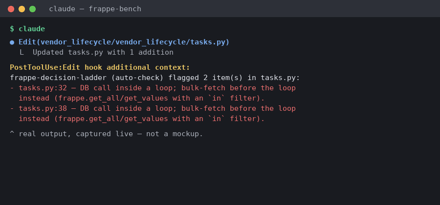

# Central AI Rules

A shared library of AI coding skills for Frappe / ERPNext development.
Installed once per project via symlinks — all projects automatically sync when new skills are added.

---

## ⚡ Quick Setup

```bash
# 1. Clone the central repo (once)
git clone https://github.com/anoopverma-collab/FrappeForge.git ~/.claude-skills

# 2. Enter YOUR PROJECT directory
cd /path/to/your/frappe-project

# 3. Run the installer (one-time per project)
~/.claude-skills/install-skills.sh
```

The installer will show an interactive menu — toggle which tools to configure (Claude, Kiro, AmazonQ) using number keys, then press Enter to confirm.

That's it. The script will:
- Create the skills directory for each selected tool (e.g. `.claude/skills/`, `.kiro/steering/`, `.amazonq/rules/`)
- Symlink all central skills into each selected tool's directory
- Register your project in `~/.claude-skills/projects.txt`
- Update your `.gitignore` to exclude symlinks for each selected tool
- Report any conflicts (real folders with same name as central skills)

---

## 🔄 Multi-Project Sync

Once setup in multiple projects, one command updates everything:

```bash
cd ~/.claude-skills
git pull
# post-merge hook automatically runs install-skills.sh in all registered projects
```

All your projects now have the latest skills — no manual updates needed.

---

## 📝 Adding New Skills to Central Repo

Skills are authored directly in the central repo:

```bash
cd ~/.claude-skills
git checkout -b add-my-skill
mkdir my-skill
# Create SKILL.md and reference/ inside my-skill/
git add my-skill
git commit -m "Add my-skill"
git push -u origin add-my-skill
gh pr create
```

Once merged, the post-merge hook automatically makes it available in all projects.

---

## 🛠 Available Skills

Most skills below document how to write a specific kind of Frappe code correctly. **frappe-decision-ladder** sits on top of all of them — it's a "write the least code necessary" discipline: check whether a Custom Field, Property Setter, Workflow, or sibling app already does the job before writing anything new, and a full-sweep workflow that combines that check with every other skill's anti-patterns reference for one combined report. A subset of it also runs unconditionally via a `PostToolUse` hook (`skills/frappe-decision-ladder/hooks/frappe_ladder_check.py`) — wiring instructions are in that skill's own file.



Full detail — the ladder, benefits, all three workflows, per-rung examples, and the decision-log mechanism — lives in [`skills/frappe-decision-ladder/SKILL.md`](skills/frappe-decision-ladder/SKILL.md).

| Skill | Description |
| :--- | :--- |
| **frappe-core-database** | Database operations (frappe.db), ORM patterns, raw SQL, and performance optimization. |
| **frappe-core-permissions** | Permission system implementation including roles, user permissions, and data masking. |
| **frappe-decision-ladder** | Minimal-code discipline: config-before-code ladder, diff review, whole-app audit, and a full sweep across every other skill's anti-patterns. |
| **frappe-impl-reports** | Building Script Reports, Query Reports, dashboard charts, and Number Cards. |
| **frappe-impl-ui-components** | Custom dialogs, List View extensions, Page controllers, and Realtime updates. |
| **frappe-syntax-clientscripts** | Client-side JS for form events, field manipulation, and server calls. |
| **frappe-syntax-controllers** | Python Document Controllers and lifecycle hooks (validate, on_update, on_submit). |
| **frappe-syntax-hooks** | App configuration in `hooks.py` (scheduler, fixtures, overrides, and routing). |
| **frappe-syntax-hooks-events** | Document lifecycle hooks via `doc_events` and execution order management. |
| **frappe-syntax-scheduler** | Configuring scheduler events and async background jobs using `frappe.enqueue`. |
| **frappe-syntax-serverscripts** | Python Server Scripts for Document Events and API endpoints (sandbox-safe). |
| **frappe-syntax-whitelisted** | Creating and calling Whitelisted Methods (Python API endpoints). |

---

## 📁 File Structure

```
~/.claude-skills/
├── install-skills.sh          # Project installer (symlinks skills, registers projects)
├── .git/hooks/post-merge      # Auto-updates all projects after git pull
├── projects.txt               # Registry of all projects using these skills
├── index.md                   # Shared reference to add to your claude.md
└── skills/
    ├── frappe-core-database/
    │   ├── SKILL.md
    │   └── reference/
    ├── frappe-core-permissions/
    │   ├── SKILL.md
    │   └── reference/
    └── ... (other skills)
```

Your project (example with all tools selected):
```
/path/to/project/
├── .claude/
│   └── skills/
│       ├── frappe-core-database -> ~/.claude-skills/skills/frappe-core-database
│       ├── frappe-syntax-hooks -> ~/.claude-skills/skills/frappe-syntax-hooks
│       └── ... (symlinks to central skills)
├── .kiro/
│   └── steering/
│       └── ... (symlinks to central skills)
├── .amazonq/
│   └── rules/
│       └── ... (symlinks to central skills)
├── .gitignore          # excludes symlink dirs for all selected tools
└── ... (your code)
```

---

## ⚠️ Conflict Handling

If your project already has a **real folder** with the same name as a central skill, the installer will skip it and list the conflicts:

```
Conflicts — real folders found with same name as central skills:
  ! /path/to/project/.claude/skills/my-conflicting-skill
```

**You decide:**
- **Delete it** to use the central version: `rm -rf .claude/skills/my-skill && /path/to/install-skills.sh`
- **Keep it** to use your local, project-specific version

---

## 📖 Using Skills in Claude

Add the skills reference to your project's `claude.md` :

```markdown
Include: ~/.claude-skills/index.md
```

Claude Code will then have access to all shared (and project-local) skills.

---

## 🔧 Troubleshooting

**Q: New skill added to central repo, but I don't see it in my project?**
- Run `git pull` in `~/.claude-skills/` — the tracked `post-merge` hook (wired via `git config core.hooksPath githooks`, set automatically by `install-skills.sh`) auto-syncs new skills into every tool directory a registered project already uses.
- Or manually: run `~/.claude-skills/verify-install.sh` to see exactly what's missing across all registered projects, or `~/.claude-skills/install-skills.sh` in one project to (re)confirm your tool selection.

**Q: How do I check my setup is actually working, without guessing?**
- Run `~/.claude-skills/verify-install.sh`. It checks every registered project for missing/broken skill symlinks and a missing `index.md` include in `CLAUDE.md` (or the Kiro/AmazonQ equivalents), and exits non-zero if anything's wrong — so a misconfigured project shows up loudly instead of just getting silently zero benefit.

**Q: I have a conflict. How do I resolve it?**
- The installer lists conflicting folders. Choose: delete to use central, or keep to use your local version.
- Once decided, re-run the installer.

**Q: Can I have project-specific skills?**
- Yes! Create a real folder in `.claude/skills/my-local-skill/` and commit it. Symlinks are ignored in git, only real folders are committed.

**Q: What if I unregister a project?**
- Manually edit `~/.claude-skills/projects.txt` and remove the project path. The post-merge hook won't update it anymore, but symlinks remain.

---

## 🎯 Workflow Summary

| Step | Command | What happens |
|------|---------|--------------|
| First time | `install-skills.sh` | Symlinks all central skills, registers project |
| Add new skill | (in central repo) `git checkout -b ...` | Author directly in `~/.claude-skills/skills/` |
| Share skill | `git commit` + `git push` + `gh pr create` | Create PR in central repo |
| Get new skills | `git pull` (in central) | post-merge hook auto-updates all projects |
| Use in Claude | Include central `index.md` in your `claude.md` | Access all skills |

---

## 🏷 Versioning & pinning

By default every project tracks `main` directly — a change merged centrally reaches every project on the next `git pull`, with no per-project approval gate before rollout. For a client engagement where you want a stable, reviewed baseline instead:

1. Pick a tagged release from `CHANGELOG.md` (e.g. `v1.1.0`) and note it in the project's own docs — this repo does not currently enforce or automate per-project version pinning.
2. Before upgrading a pinned project, read the diff between your current tag and the target one (`git log v1.0.0..v1.1.0 --oneline` in `~/.claude-skills`), not just the latest commit message.
3. New tags are cut manually (`git tag vX.Y.Z && git push origin vX.Y.Z`) after a change has been reviewed — there is no CI gate enforcing this yet (see "Known limitations" below).

## 🧪 Testing

`bitbucket-pipelines.yml` runs `skills/frappe-decision-ladder/hooks/test_frappe_ladder_check.py` on every push and pull request. Any change to `frappe_ladder_check.py` should pass this locally (`python3 -m unittest skills/frappe-decision-ladder/hooks/test_frappe_ladder_check.py -v`) before merging — it's wired as an always-on hook, so a false positive or crash there hits every edit in every bench, not just one.

## ⚠️ Known limitations

- **No enforced review gate.** PR-based contribution is the intended workflow, but nothing on the Bitbucket side currently requires review or a passing pipeline before a merge to `main` — that needs branch-protection rules configured in the repo settings (repo-admin action, not something this repo's files can enforce on their own).
- **Early-stage.** Single-maintainer, no external usage yet. Treat skill content with the same scrutiny you'd give any new internal tool, especially the `frappe-decision-ladder` hook since it runs unconditionally.
- **Not a substitute for testing.** This shapes how code gets *written* (config-first, minimal, idiomatic) — it doesn't verify the code *works*. Your existing BRD/BBP, UAT sign-off, and regression testing discipline on client engagements are unaffected and still required.
- **Depends on the tool actually loading these files.** If a teammate's `CLAUDE.md` doesn't include `index.md`, or their tool doesn't read `.claude/skills/`, they get no benefit with no visible error from Claude/Kiro/AmazonQ itself — run `verify-install.sh` periodically to catch this instead of assuming silence means it's working.
